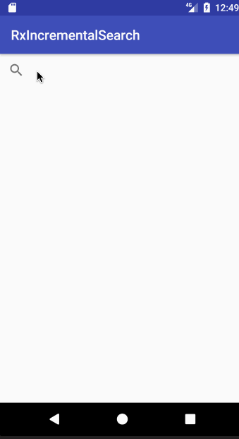

# RxIncremental Search

Rx Incremental Search is a sample app that searches StackOverflow questions and displays search results
to the user as the user is typing.



This is an exploration into managing asynchronous request state with RxJava 
and synchronous app actions (updating the UI) within the structure of a larger application.

It attempts to avoid some of the common mistakes and inefficiencies made when 
implementing Rx:
* Coupling asynchronous action logic to the activity/UI lifecycle 
    * What if the UI is destroyed and recreated during an asynchronous action chain (screen rotation)?
* Pulling data out of the UI within an asynchronous task
    * What if UI attributes change after the task has started?
* Performing actions (network requests, UI updates) too often as a result of not curating
emitted observables or managing request state
    * If the exact same request is made in quick succession, should you perform that action or update
    the UI every single time?
    
Brief overview on how this is accomplished:
### Decoupling logic from the activity lifecycle
A view model layer is used to manage the state of incoming and existing search requests, fired off
as the user is typing a query. Because the view model exists separately from the activity and has no 
reliance on the activity lifecycle, request states are preserved regardless of what happens to the UI.

### Eliminating the need to pull data out of the UI during an asynchronous chain
To prevent having to reach back into the UI, a `QueryTextChangeEvent` model object is used to store all data 
needed to perform the search. When the query text changes, a `QueryTextChangeEvent` object holds the 
query information and is passed along with the subscription or trigger to action to the code that 
will perform the search network request. 
```
disposable.add(RxSearchView.queryTextChanges(searchView)
        .map(ignored -> new QueryTextChangeEvent(searchView.getQuery().toString()))
        .subscribe(...));
```
Not only does this prevent the additional action of grabbing
data from the UI, but it also ensures that the data used to perform the search accurately reflects the 
query intended at the time of the action. Without this approach, reaching back into the UI 
could result in the search being performed on the wrong query if the user had changed the input before
a following call to go back and grab this parameter.

### Tracking asynchronous action state to manage UI updates
The view model utilizes a `SearchActionStateModel` object to track the status of an executing request 
throughout an observable/subscription chain without interacting directly with the UI. `SearchActionStateModel` 
can have functions to denote statuses`inProgress()`, `success()`, `failure()`, etc. When an asynchronous 
network request for search is kicked off, it begins by immediately noting the fact that it is `inProgress()`, 
and later setting the state to `success()` or `failure()` depending on the result.

```
Observable<SearchActionStateModel> model = events
        .flatMap(event -> service.searchQuestions(event.getQueryString())
                .map(response -> actionStateModel.success())
                .onErrorReturn(t -> actionStateModel.failure(t))
                .observeOn(AndroidSchedulers.mainThread())
                .startWith(actionStateModel.inProgress());
```

Separate code meant to update the UI based on the results of the above observable can refer to the status set 
in `SearchActionStateModel` to check the state of the search action and act accordingly.
```
disposables.add(RxSearchView.queryTextChanges(searchView)
        .map(ignored -> new QueryTextChangeEvent(searchView.getQuery().toString()))
        .compose(model)
        .subscribe(model -> {
            if (!actionStateModel.isInProgress()) {
                if (actionStateModel.isSuccess()) {
                    updateUi();
                } else {
                    showError();
                }
            }
        }, t -> { throw new OnErrorNotImplementedException(t); }));
```

### Performing updates/requests too often
A simple observable set up might look like this:
```
disposables.add(events
        .flatMap(event -> service.searchQuestions(event.getQueryString())
                .map(response -> onSuccess(response))
                .onErrorReturn(t -> onFailure(t))
                .observeOn(AndroidSchedulers.mainThread()));
```
This implementation is fine for most cases - every time an event is emitted, perform the `onSuccess`
or `onFailure` action desired. But what if a high number of events are emitted all at once? Should you,
for example, update the UI as many times as the number events you received? What if the user is only interested
in the result of the final event, as is the case with a search? In that case, it is preferable to use 
`switchMap()` over `flatMap()`:
```
disposables.add(events
        .flatMap(event -> service.searchQuestions(event.getQueryString())
                .map(response -> onSuccess(response))
                .onErrorReturn(t -> onFailure(t))
                .observeOn(AndroidSchedulers.mainThread()));
```
`switchMap()` behaves like `flatMap()`, but subscribes only to the latest observable emitted; any old observables are 
unsubscribed from, preventing any action being taken based on stale input.

## Architecture/Practices
* MVVM (Model-View-ViewModel)
* Dependency Injection (Dagger)
* Unit Testing (Mockito)
* View Binding (ButterKnife)

Credit to Jake Wharton's presentation "Managing State with RxJava" for inspiring this project and providing
examples of good practice with RxJava.